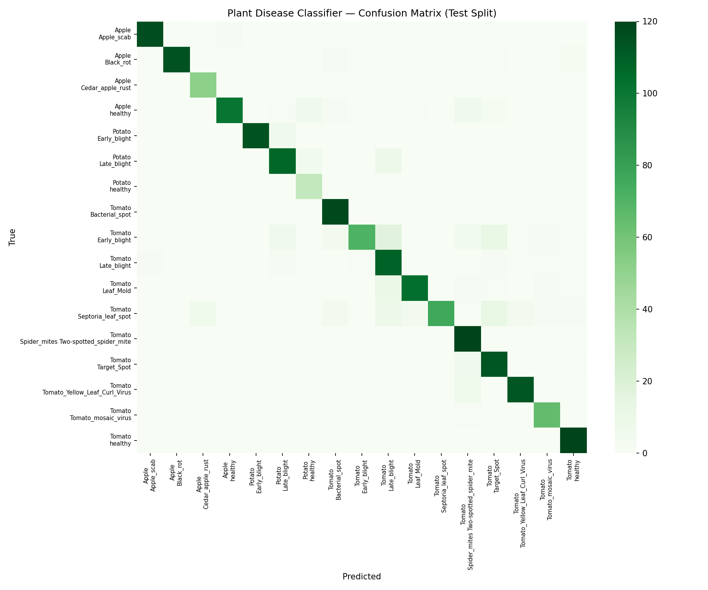

# Plant Disease Live Demo

[](https://plant-disease-live-demo.onrender.com)



**Live demo:** https://plant-disease-live-demo.onrender.com — upload a tomato, potato, apple, or bell pepper leaf photo and get an instant disease diagnosis with confidence scores.

> **Note:** This runs on Render's free tier, which spins down after ~15 minutes of inactivity. The first request after idle time may take **30–60 seconds** to respond while the container wakes up — this is normal, not a bug.

## What this does

This project is a production-style computer vision demo for **crop leaf disease screening**. A grower or agronomist uploads a smartphone photo of a leaf; a fine-tuned MobileNetV3 classifier predicts the most likely disease (or healthy status) among 17 classes across four high-value crops. The app includes a FastAPI backend with validated REST endpoints, a drag-and-drop web UI, Docker packaging, and measured inference latency.

## Why I built it this way

- **Task choice:** Plant disease detection is a concrete B2B/ag-tech use case (early intervention saves yield), easy to demo visually, and maps cleanly to image classification.
- **Fine-tuned, not generic:** The model is adapted on a focused PlantVillage subset (tomato, potato, apple, bell pepper) rather than shipping a raw ImageNet checkpoint.
- **FastAPI + static frontend:** Separating API from UI mirrors real deployments (mobile apps, partner integrations) while keeping the demo lightweight.
- **MobileNetV3-Small:** Small enough for CPU inference in Docker (~6 MB weights) while reaching ~90% test accuracy on the held-out split.
- **Docker on port 7860:** Containerized for local dev and cloud deployment (Render).

## Setup / how to run

Requires Python 3.12+, Docker (optional), and ~2 GB disk for the PlantVillage download.

```bash
git clone https://github.com/lyyn002/plant-disease-live-demo.git
cd plant-disease-live-demo

python3.12 -m venv .venv
source .venv/bin/activate
pip install -r requirements.txt

# Download PlantVillage subset and fine-tune (or skip if models/ already present)
PYTHONPATH=. python scripts/prepare_data.py --max-per-class 120
PYTHONPATH=. python scripts/train.py --epochs 5 --max-per-class 120

# Run API + UI locally
PYTHONPATH=. uvicorn backend.app.main:app --host 0.0.0.0 --port 7860
# Open http://localhost:7860
```

### Docker

```bash
docker build -t plant-disease-live-demo .
docker run --rm -p 7860:7860 plant-disease-live-demo
```

Verified locally: `docker build` succeeds and `docker run` serves `/health` with `model_loaded: true`.

### Deploy to Render

The app is deployed at [plant-disease-live-demo.onrender.com](https://plant-disease-live-demo.onrender.com) via Docker. To redeploy from scratch:

1. Push this repo to GitHub.
2. In [Render](https://dashboard.render.com), create a **Web Service** → connect the repo → choose **Docker** → **Free** instance.
3. Leave **Root Directory** empty; set **Dockerfile Path** to `Dockerfile`.

Or use the included `render.yaml` blueprint for one-click setup.

## Results (measured on this machine)

**Test split (1,830 images, 17 classes):**

| Metric | Value |
|---|---:|
| Accuracy | **89.84%** |
| Macro F1 | **0.896** |
| Weighted F1 | **0.896** |

Hardest classes on this subset: `Tomato___Early_blight` (F1 0.740) and `Tomato___Septoria_leaf_spot` (F1 0.776) — visually similar early-stage lesions.

**Inference latency (30 runs each):**

| Environment | Mean | P95 |
|---|---:|---:|
| Render (live, CPU free tier) | **4016 ms** | — |
| Docker container (local) | **5.57 ms** | **5.88 ms** |
| Local MPS (dev hardware) | 4.03 ms | 4.38 ms |

Docker numbers include full HTTP round-trip to `POST /api/v1/predict`. Render latency reflects shared 0.1-CPU free-tier hardware; warm requests are faster after the container is awake.

## What I'd improve with more time

- Add Grad-CAM heatmaps so users see *where* the model looked on the leaf.
- Expand crops (corn, grape) and collect field photos to reduce domain shift vs. lab backgrounds.
- Add rate limiting, request IDs, and structured logging (OpenTelemetry) for real production traffic.
- Serve ONNX/TensorRT exports for edge devices in greenhouses.

## Tech stack

- Python 3.12, PyTorch 2.9, torchvision, MobileNetV3-Small
- PlantVillage dataset (tomato / potato / apple / bell pepper subset)
- FastAPI, Pydantic, Uvicorn
- HTML/CSS/JS frontend
- Docker, Render
- scikit-learn (evaluation), matplotlib/seaborn (plots)
